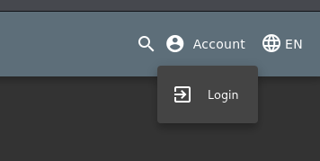
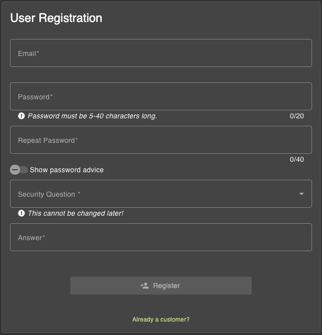

Readme 

# Table of Contents 


## Perrquites 

## Quickstart 


## Usage 
You can also Start your own Owasp Juice Shop Instance on your Compouter. 


1. Install Perequireties 
``` bash
sudo apt install nodejs
sudo apt install npm
```

1. Clone the following Repository 
``` bash
git clone https://github.com/juice-shop/juice-shop.git
```


2. Navigate to the Correct Directory. 
```bash
cd juice-shop
```


3. Start the Juice Shop 
``` bash
npm start 
```

4. Open your Juice Shop on your Browser with:
```bash
127.0.0.1:3000
```


## Possible Attacs 
### XSS Song 

You can find a Video Descrition on this following Link:
```bash
https://www.loom.com/share/6a78aeb3b1a2442eb0752b79d08bbf71
```


1. Navigate to Serchnavigation: 


2. Put this following Iframe on the Search Field: 
```bash
<iframe width="100%" height="166" scrolling="no" frameborder="no" allow="autoplay" src="https://w.soundcloud.com/player/?url=https%3A//api.soundcloud.com/tracks/771984076&color=%23ff5500&auto_play=true&hide_related=false&show_comments=true&show_user=true&show_reposts=false&show_teaser=true"></iframe>
```

3. Now you can see a Box where you can play and stop the loaded Music. 


### Admin Login with SQL Injection 
You can find a Video Descrition on this following Link:
```bash
https://www.loom.com/share/bf3255d1e2d344f9b22b60c12c3f3687
```

1. Navigate to login: 
```
Account-Login
```


2. Login 

For email use the following Command: 
```bash
'OR 1=1--
```
Type in any password — it can be anything, just make sure the field isn't empty.


Gratulate! You are logged in as a Admin on the OWASP Juice Shop. 


### Find Privacy Policy 
You can find a Video Descrition on this following Link:
```bash
https://www.loom.com/share/6d6850f2073c45e2a9db9226cea5b075
```
1. Create a Acount on your Owasp Juice Shop. 
Navigate: 
```
Account-Login-"Not jet a Customer" 
```


2. Fill in your own Email Adress and Password 


3. Login with your created Account. Alternative you can use the Admin Account from your SQL Admin Attack. 

4. Navigate to Acount-Privacy&Security -Privacy Policy 


You got it ! 